# HDRescuer

Aplicación móvil para Android con la que recopilar datos fisiológicos de pacientes provenientes de distintos dispositivos wearables adheridos al paciente y con la que registrar sesiones de esfuerzo, entrenamiento, reposo, etc.

Los distintos dispositivos wearables se comunican con la aplicación via Bluetooth, y esta es capaz tanto de almacenar sesiones como de enviar los datos en tiempo real hacia un servidor basado en una arquitectura orientada a microservicios.

Los datos fisiológicos de pacientes pueden ser utilizados para entrenar modelos de aprendizaje automático capaces de predecir por ejemplo si un paciente está infectado por algún virus o detectar problemas cardíacos, etc.   

## Contexto e instalación

El sistema se ha desarrollado como uno de los subsistemas necesarios para llevar a cabo mi TFG:  
**Sistema IoT para la detección de pacientes con infecciones por Virus**.

En este sentido también se ha desarrollado un subsistema de un servidor basado en arquitectura orientada a microservicios donde se procesa la información del paciente recibida, se almacenan las sesiones del mismo, etc. 

Los microservicios, dockerizados y listos para utilizar se encuentran en la carpeta **doc/HDRescuer_Server**. Antes de utilizarlos, habrá que cambiar la dirección ip del host, alqo que debe hacerse en el microservicio ApiGateway en el archivo /config/gateway.config.yml en todas las ocurrencias, así como en el microservicio ApiComposer en /common/endpoints. Finalmente estos microservicios pueden lanzarse a través de un archivo bash *start.sh*

Los dispositivos utilizados para recopilar datos fisiológicos de pacientes son:

- **SmartWatch TicWatch Pro** (Con una aplicación que también he desarrollado en WearOs para este dispositivo, cuyo proyecto está en la carpeta **hdrescuerwatch**)
- **Pulsera de salud Empatica E4** (Cuya integración está en la propia aplicación para Smartphone)
- **Placa de Salud HealthBoard + Arduino** (Pulsioxímetro e Intensidad respiración. Cuyo sketch arduino se encuentra en la carpeta **doc/Programa Arduino eHealthBoard**)   

## Funcionalidades

El sistema dispone de multitud de funcionalidades orientadas a la recopilación de datos fisiológicos y a la gestión de pacientes, donde se tienen en cuenta los problemas más comunes a la hora de recopilar estos datos, como son la pérdida de los mismos en la transmisión hacia el servidor, pérdidas de conexión o indisponibilidad total de conexión a internet.

Además, se proveen herramientas gráficas de visualización con las que un profesional sanitario podría ver los datos recopilados en la sesión del paciente en el acto, en su smartphone, sin tener que disponer de conexión o estar físicamente en su despacho.

Entre las funcionalidades principales destacan:

- **Modo de funcionamiento *Standard***:
    - Submodo Streaming:
        Modo por defecto al acceder con conexión. Las sesiones se guardan tanto en local como en el servidor via streaming en tiempo real al realizarse la recopilación de datos.

    - Submodo Offline: Modo por defecto al acceder sin conexión. Las sesiones se guardan solamente en modo local, pudiendo ser sincronizadas/subidas al servidor cuando se disponga de conexión.

- **Modo de funcionamiento *FastMode***: No es necesario conexión. Las sesiones se recopilan en el acto, sin tener que estar vinculadas a un paciente. Posteriormente se pueden vincular a un paciente y sincronizarlas con el servidor. 

- **Configuración de la tasa de muestreo** de recopilación de datos: Pudiendo tomar medidas cada X ms que indiquemos.

- **Gestión de pacientes y sesiones**: La aplicación permite crear y editar pacientes, pudiendo comenzar nuevas sesiones de recopilación sobre ellos, así como visualizar el histórico de sesiones de cada paciente. Adicionalmente se incorporan indicadores de la calidad de la sesión, pudiendo indicar si la sesión se ha sincronizado correctamente con el servidor, o si en cambio se han perdido datos en la transmisión o se ha recopilado de forma Offline, pudiendo sincronizar la sesión con el servidor posteriormente.

- **Vinculación con dispositivos personalizada**: La aplicación permite vincular los dispositivos que se deseen de entre los 3 para los que se ha diseñado. Durante la recopilación se podrán ver los valores de los sensores de estos dispositivos en tiempo real. 

- **Gráficas de resultados**: La aplicación permite la visualización de todos los datos recopilados al finalizar la sesión o en el histórico del paciente en forma de gráficas muy manipulables y visuales. Se hace uso de la librería [MPAndroid Chart](https://github.com/PhilJay/MPAndroidChart).    

## Capturas de pantalla    

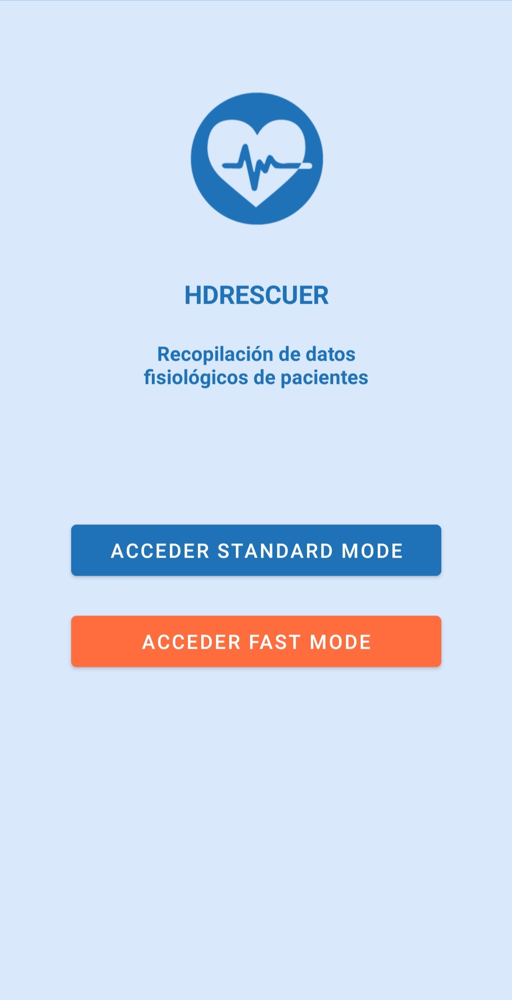&nbsp; &nbsp;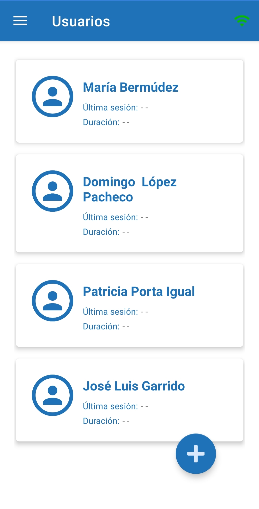&nbsp; &nbsp;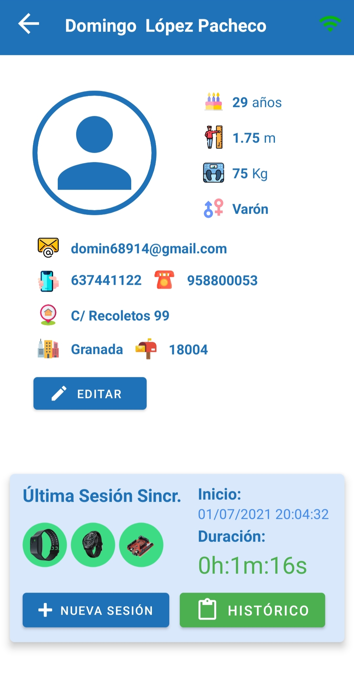

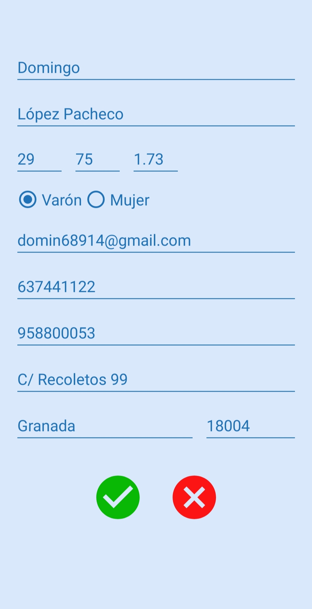&nbsp; &nbsp;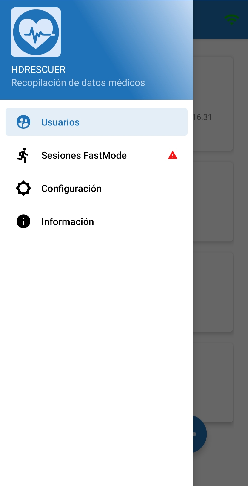&nbsp; &nbsp;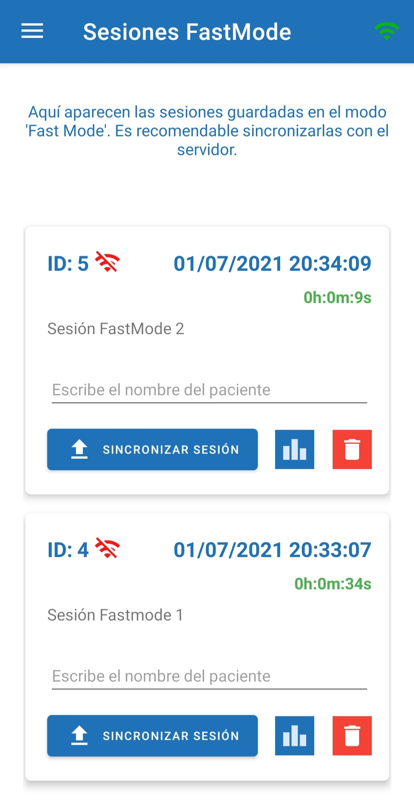

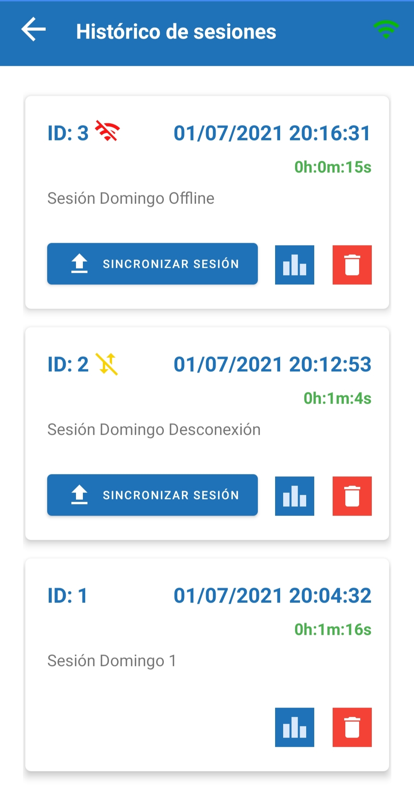&nbsp; &nbsp;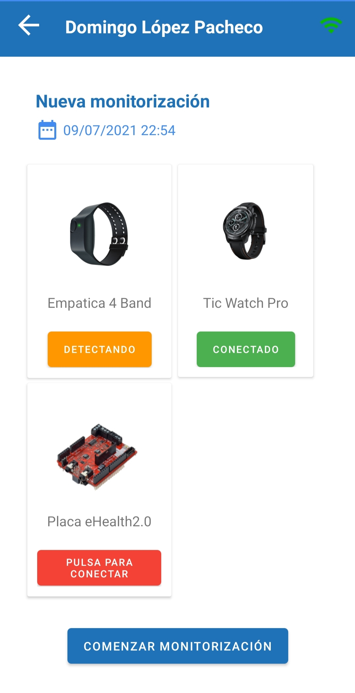&nbsp; &nbsp;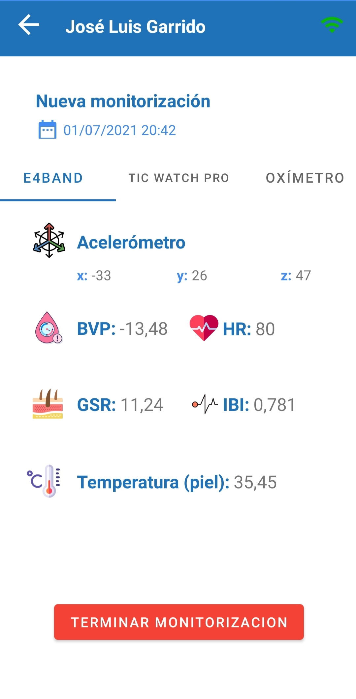

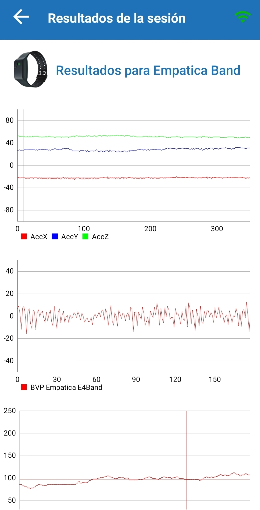&nbsp; &nbsp;&nbsp; &nbsp;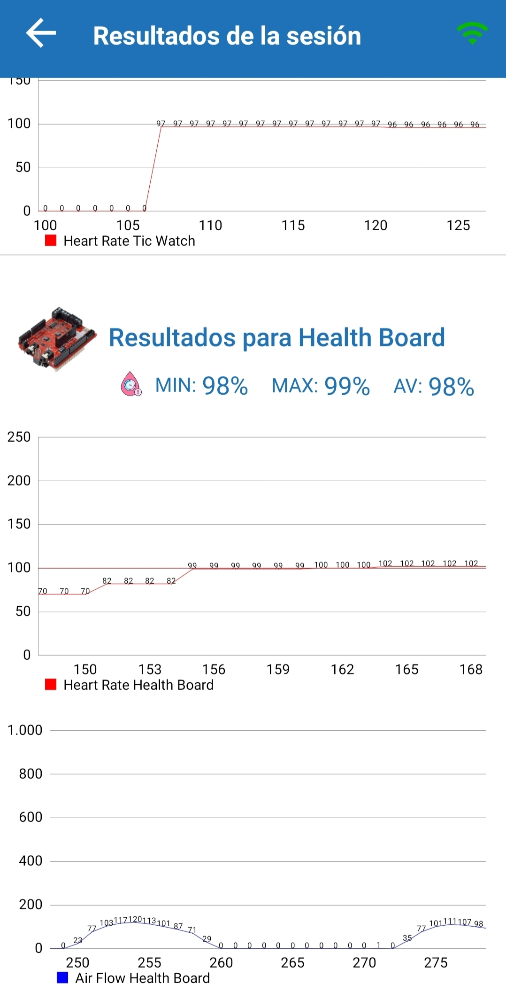

